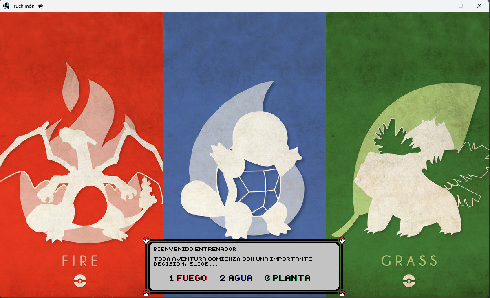

# Truchimon 👾

## Equipo de desarrollo

- Ulrich, Marcelo
- Lopez, Maria Sol
- Foglia, Pablo Daniel
- Rodriguez, Javier Ceferino

## Capturas

---

---

---

## Reglas de Juego / Instrucciones

Truchimon! Juego de aventura y exploracion donde tu objetivo sera hacerte de una coleccion digna de truchimones para derrotar a La Liga del Coliseo, un grupo de tres enemigos audaces quienes te daran pelea hasta la muerte. Deberas ir capturando Truchimones a lo largo del mapa para formar el "Dream Team" que logre derrotar a todos los integrantes de la Liga del Coliseo. 

Podras...

- Moverte libremente por el mapa (Arrows)
- Encontrar aleatoriamente Truchimones y batallar conta ellos
  - Podras constantemente ir atrapando Truchimones nuevos a medida que desees
  - Decidiras si atraparlos o no
  - Dependera de si tienes truchibolas en el inventario
- Entrar al hospital para...
  - Restaurarle la vida a todos tus Truchimones (acercandote a cualquiera de las camas arriba a la derecha)
  - Recoger Truchibolas de la maquina dispensadora arriba en el medio
- Encontrar a los integrantes de La Liga del Coliseo y batallar contra ellos
  - Deberas derrotarlos a todos para ganar el juego

## Otros

- Curso/Facultad: 2do cuatrimestre / UNSAM
- Versión de wollok: v3.0.0
- Una vez terminado, no tenemos problemas en que el repositorio sea público
